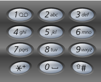

## 电话号码的字母组合

> 难度：中等         思路：递归

### 一、题目描述

给定一个仅包含数字`2-9`的字符串，返回所以它能表示的字母组合。

给出数字到字母的映射如下（与电话按键相同）。注意`1`不对应任何字母。
<!--more-->


示例：

输入：“23”

输出：["ad", "ae", "af", "bd", "be", "bf", "cd", "ce", "cf"]

### 二、解题过程

拿到这个题目，分析我们要解决的问题，题目给出了数字到字母的映射，故首先要把映射关系一一对应出来，在Python中很容易想到字典，把映射关系先存起来，唯一值得推敲的是这里的值的类型是存成字符串`"abc"`还是数组`['a','b','c']`呢？看到电话按键我们很容易想到字符串，但研究我们最终的输出结果类型，存为数组类型更方便后边的计算，如下：

```Python
 dict_map = {'2':['a','b','c'], '3':['d','e','f'], 
             '4':['g','h','i'], '5':['j','k','l'], 
             '6':['m','n','o'], '7':['p','q','r','s'],
             '8':['t','u','v'], '9':['w','x','y','z']}
```

第二步来到了怎么解决这个题目，这个题目看起来很简单，实际上也很简单但就需要那么灵光一现，首先把它的结构图画出来，本质上是一个全组合问题，通过for循环遍历给出的数字所对应的字母，然后内部嵌套for循环遍历下一个数字对应的字母，就这样层层嵌套，唯一的难点是我们无法提前预知需要嵌套多少层for循环。

灵光乍现了，递归函数能够很好的解决这种循环问题。通过认真分析，发现这题用递归是最棒的方法。首先来复习一下递归：

递归将问题分解为越来越小的子问题，直到问题的规模小到可以被直接解决。**每个递归函数都有两个部分：基线条件和递归条件 **。递归条件指的是函数调用自己，而基线条件是指函数不再调用自己，从而避免无限循环。

如果你还对递归算法有疑问的话，试着写一个关于某个数阶乘的递归算法，`fact(n) return n*(n-1)*(n-2)...`规定`0！=1`，最合适的基线条件什么呢？

分析此题，基线条件可以是待访问的数字个数为1时，返回这个键的映射值；递归条件为访问当前访问数字的第一个数字，然后for循环遍历这个数字对应的字母，在for循环内部，将数字的第一位去掉然后调用函数本身。然后for循环遍历返回值。

完整代码如下：

```Python
class Solution:
    def letterCombinations(self, digits):
        dict_map = {'2':['a','b','c'], '3':['d','e','f'], 
                    '4':['g','h','i'], '5':['j','k','l'], 
                    '6':['m','n','o'], '7':['p','q','r','s'],
                    '8':['t','u','v'], '9':['w','x','y','z']}
        res = []
        if len(digits) :           
            if len(digits) == 1:
                return dict_map[digits[0]]
            else:
                first = dict_map[digits[0]]
                for x in first:
                    second = self.letterCombinations(digits[1:])
                    for y in second:
                        t = x + y
                        res.append(t)
                return res 
        return res 
```

