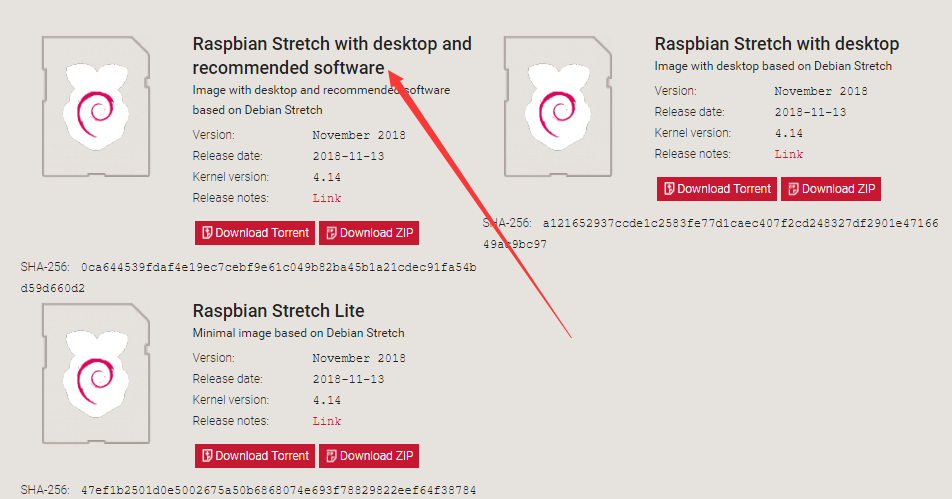
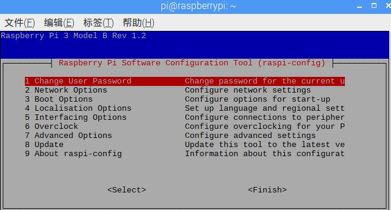
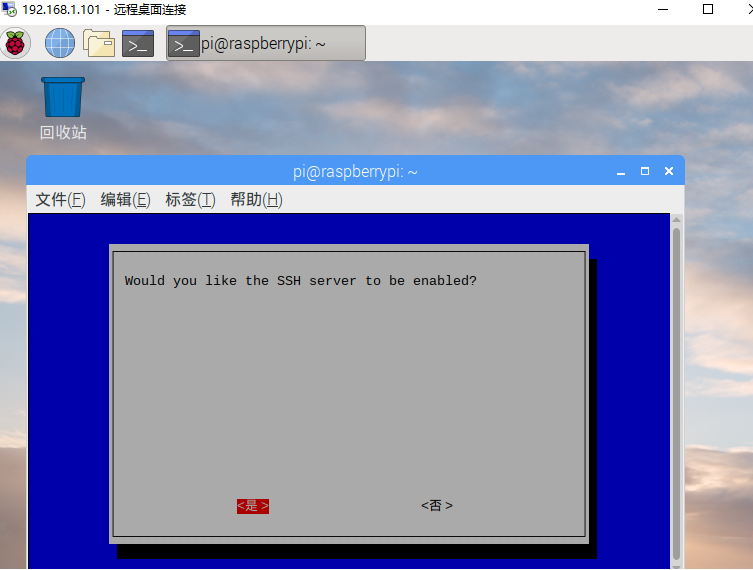
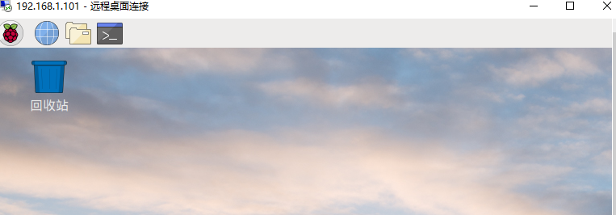
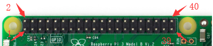
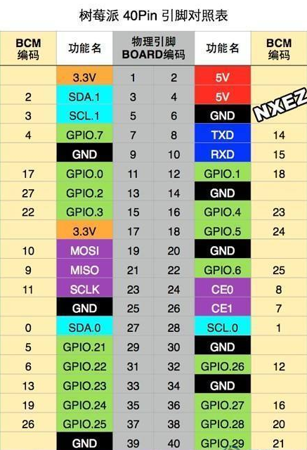

## 树莓派入门（控制LED灯）

author： 刘真真

### 一、板载资源+配件

树莓派是迷你主机，集成在一块电路板上。其型号为RAspberry Pi 三代  B型。

**电源 ：**Micro USB 接口的手机充电器，输出5V2A

**Micro SD卡 **：充当硬盘功能，大小最好在8G以上。

**显示器**：HDMI接口的显示器，需要屏幕则接

**键盘**：树莓派内置蓝牙，USB或蓝牙的无线键盘都可以用。需要时则配。

### 二、电子元件

1、面包板

2、一段公头一端母头的杜邦线

3、LED二极管

4、1K的电阻
<!--more-->
### 三、安装系统

**1、下载树莓派系统**

网址

```  https://www.
https://www.raspberrypi.org/downloads/
```

选择需要的系统即可。这里我们选择树莓派官方的系统，自带的预装了桌面和一部分的软件的系统，如下图箭头所指。如果有一定的开源系统使用经验，可以选择最为轻量的裸机。

**2、将SD卡格式化 **

​     直接在文件资源管理器中将SD卡格式化即可

**3、下载将系统导入内存卡的工具etcher**

``` python
https:/etcher.io/
```

安装成功后打开，首先选择下载好的系统镜像文件，然后选择树莓派内存卡，点击Flash。

注意：**在此过程中如果提示不可识别文件系统或者要格式化，直接点X关闭即可。**

flash完成后，将内存卡取下插入树莓派，开机机即可查看新系统！

### 四、SSH登录

安装系统之后，树莓派就可以上网了，这里我们用WIFI上网。树莓派系统默认关闭SSH,这里首先需要打开树莓派的SSH。

在命令行输入：

```python
sudo raspi-config
```

得到如下的设置



进入P2 SSH



使能SSH即可

电脑和树莓派连接同一个路由器，在浏览器访问路由器的IP（192.168.1.1），用户名admin 密码admin，得到树莓派的IP地址为192.168.1.101。

在客户端输入

```python
ssh pi@192.168.1.101
```

输入树莓派的用户名 pi 和密码 123456与树莓派建立连接。

### 五、远程桌面

为了更加方便地操作树莓派，安装远程桌面。打开树莓派终端，输入

``` 
sudo apt-get install xrdp
```

等待安装完成。

打开电脑的远程桌面


输入树莓派的IP地址 

远程桌面操作 用户名 pi  密码 123456



### 六、点亮LED

树莓派提供了一组通用IO口，称为GPIO。40个引脚的定义如下






下面将树莓派和电子元器件连起来。

注意二级管的正负极。正极接3.3V，负极通过电阻接地，可以看到二极管亮了。下面使用Node脚本控制LED。

首先，将接地的导线从GND针脚拔出，接到GPIO0.0即11号引脚。

注意，3.3V的针脚是是有标识的，其他针脚都是圆的。

代码如下：

```node
var rpio = require('rpio')
rpio.open(11, rpio.OUTPUT)

function blink(){
    rpio.write(11, rpio.HIGH);
    setTimeout(function ledoff(){
        rpio.write(11, rpio.LOW);
    },50);
}

setInterval(blink, 100);
```

用node.js稍作尝试，接下来轮到主角python出场了，Linux系统中很多功能是通过python实现的，且内嵌了python，无需安装，与python的兼容性极好，所以尝试用Python使LED闪烁。

代码如下

```python
#!/usr/bin/python
#author:lzz
import RPi.GPIO as GPIO
import time

GPIO.setwarnings(False)

GPIO.setmode(GPIO.BOARD)#BCM和BOARD两种命名模式
GPIO.setup(11, GPIO.OUT)

while True:
    GPIO.output(11, GPIO.HIGH)
    time.sleep(0.05)
    GPIO.output(11, GPIO.LOW)
    time.sleep(0.05)

GPIO.cleanup()

```

> **程序逻辑：**
>
> 1、导入GPIO的包
>
> 2、导入与时间包
>
> 3、设置GPIO针的命名方式，可用的有GPIO.BCM和GPIO.BOARD，分别代表boardcom命名系统和树莓派板子上的命名系统。
>
> 4、将引脚11设置为输出
>
> 5、控制引脚11的电平高低变换
>
> 6、清除掉之前RPi.GPIO.setup()设置的状态。退出程序一定要调用，否则下次调用会出错。

