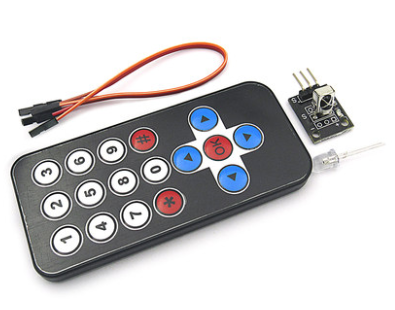
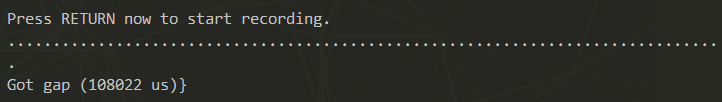
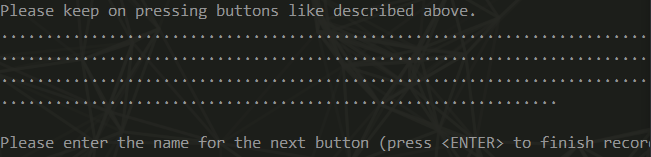
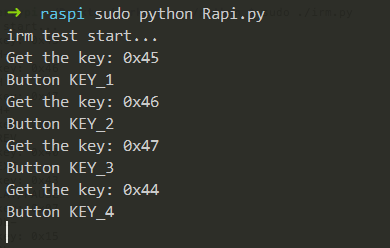

### 树莓派控制红外遥控

> **写在前面**：因项目需要，故在网上淘了一个红外遥控模块，在树莓派上学习一下红外遥控。

### 一、红外遥控及接线

​	38K通用红外遥控器，采用NEC编码格式，传输距离大于八米，比较适合日常开发，使用方便。

​	红外接收模块引脚说明：S为OUT引脚，中间为VCC，-为GND。根据模块上的标识来接。

​	插到树莓派上，S接树莓派的12引脚（物理引脚编码），其BCM编码为18；VCC接3.3V；GND接树莓派任意GND引脚即可。模块实拍如下图所示：
<!--more-->


### 二、软件配置

#### 2.1 安装lirc，修改配置文件

​	LIRC（Linux Infrared remote control）是一个Linux系统下开源的软件包，用来从远程通用红外设备上接收和发送红外信号。可以解码和发送红外信号。

​	通过SSH连接树莓派，安装lirc：

```bash
sudo apt-get install lirc
```

​	因为lirc版本更新的原因，不同的版本修改的配置文件不同，输入`lircd -v`查看lirc的版本，我是0.9.4.c，修改`/etc/lirc/lirc_options.conf`文件，用`vi`进入修改：

```ini
[lircd]
# driver = devinput
driver   = default
```

#### 2.2 修改`/boot/config.txt`

​	用`vi`进入文件内部，找到`dtoverlay`并修改如下：

```ini
dtoverlay=lirc-rpi,gpio_in_pin = 18
```

​	这里18对应树莓派BCM编码的gpio接口。

#### 2.3 重新开启lirc

```ini
sudo /etc/init.d/lircd restart
sudo modprobe lirc_rpi
```

至此，`lirc`软件配置完成

### 三、测试红外接收

#### 3.1关闭红外接收功能

命令行输入以下命令，关闭`lirc`：

```bash
sudo kill $(pidof lircd)
```

#### 3.4 测试红外接收

```bash
mode2 -d/dev/lirc0
```

用红外遥控器，对着接收器按下任意按键，屏幕会打印类似下面的内容，说明红外接收功能正常。

```ini
space 562
pulse 579
space 1672
pulse 577    
```

在这里我卡壳了，接收不到任何内容，反复检查了前面的步骤，确定无误后继续谷歌，找到了这篇博客[^1]，之前输出随意找了一个IO口，但是都没有用，把OUT连接到GPIO pin12上，然后执行

```bash
sudo dmesg | grep -i lirc
```

发现有内容了，怀疑是红外遥控的输出引脚有指定。

#### 3.5 红外编码录制

首先查看有哪些按键名并记录，输入：

```bash
sudo irrecord --list-namaspace
```

我用的几个键名是：

| 按键 | 按键名    |
| ---- | --------- |
| 1    | KEY_1     |
| 2    | KEY_2     |
| 3    | KEY_3     |
| 4    | KEY_4     |
| 5    | KEY_5     |
| 6    | KEY_6     |
| 7    | KEY_7     |
| 8    | KEY_8     |
| 9    | KEY_9     |
| 0    | KEY_0     |
| *    | KEY_STAR  |
| #    | KEY_PUND  |
| ↑    | KEY_UP    |
| ↓    | KEY_DOWN  |
| ←    | KEY_LEFT  |
| →    | KEY_RIGHT |
| OK   | KEY_OK    |

执行红外线编码录制命令：

```bash
sudo irrecord -d /dev/lirc0 ~/lircd.conf
```

刚开始需要输入文件名称，最终会根据此名称保存对应的文件名，我的文件名为`pi-key`，然后会有一堆英文提示出来，继续回车，会让你按按键，每个按键保证屏幕上输出一个`.`,一直按保证所有的按键都被按到，全部按过一遍之后就不停的按最后按的那个按键

然后就会弹出第二轮按键录入，这时也是不停按，要有耐心，循环按，使劲按，直到弹出需要你输入下一个按键的名字为止。如下：



这时依次录入按键名字，然后按下对应的按键，输入按键名字不能输删除，如果输错了也不要紧，按回车重新输入即可。将所有的按键都录入，这一步就结束了。成功之后会在~/目录下生成`pi.lircd.conf`这个文件，把这个文件放到`/etc/lirc/lircd/lircd.conf.d/`这个目录里即可，命令行输入：

```bash
sudo cp ~/pi.lircd.conf /etc/lirc/lircd.conf.d/
```

完成后重启树莓派。

### 四、运行Python代码

运行编写的Python代码，终端会显示按键的键值。

Python代码如下：

```Python
#!/usr/bin/python
#-*-coding:utf-8-*-
import RPi.GPIO as GPIO
import time
from Constants import Keys

PIN = 18
delay_time = 0.00006

GPIO.setmode(GPIO.BCM)
GPIO.setup(PIN, GPIO.IN, GPIO.PUD_UP)
print("irm test start...")

def exec_cmd(key_val):
    if(key_val==Keys.KEY_1):  
        print("Button KEY_1")  
    elif(key_val==Keys.KEY_2):  
        print("Button KEY_2")  
    elif(key_val==Keys.KEY_3):  
        print("Button KEY_3")  
    elif(key_val==Keys.KEY_4):  
        print("Button KEY_4")  
    elif(key_val==Keys.KEY_5):  
        print("Button KEY_5")  
    elif(key_val==Keys.KEY_6):  
        print("Button KEY_6")  
    elif(key_val==Keys.KEY_7):  
        print("Button KEY_7")  
    elif(key_val==Keys.KEY_8):  
        print("Button KEY_8")  
    elif(key_val==Keys.KEY_9):  
        print("Button KEY_9")  
    elif(key_val==Keys.KEY_0):  
        print("Button 0")  
    elif(key_val==Keys.KEY_STAR):  
        print("Button KEY_STAR")  
    elif(key_val==Keys.KEY_POUND):  
        print("Button KEY_POUND")  
    elif(key_val==Keys.KEY_UP):  
        print("Button KEY_UP")  
    elif(key_val==Keys.KEY_LEFT):  
        print("Button KEY_LEFT")  
    elif(key_val==Keys.KEY_OK):  
        print("Button KEY_OK")  
    elif(key_val==Keys.KEY_RIGHT):  
        print("Button KEY_RIGHT")  
    elif(key_val==Keys.KEY_DOWN):  
        print("Button KEY_DOWN")  
try:
    while True:
        if GPIO.input(PIN) == 0:
            count = 0
            while GPIO.input(PIN) ==0 and count <200:
                count +=1
                time.sleep(delay_time)
                
            while GPIO.input(PIN) == 1 and count < 80:
                count += 1
                time.sleep(delay_time)
            
            idx = 0
            cnt = 0
            data = [0, 0, 0, 0]
            for i in range(0, 32):
                count = 0
                while GPIO.input(PIN) ==1 and count < 15:
                    count += 1
                    time.sleeep(delay_time)
                
                count = 0
                while GPIO.input(PIN) == 1 and count < 40:
                    count += 1
                    time.sleep(delay_time)
                    
                if count > 8:
                    data[idx] |= 1<<cnt
                if cnt == 7:
                    cnt = 0;
                    idx +=1;
                 else:
                    cnt += 1
            if data[0]+data[1] == 0xFF and data[2]+data[3] == 0xFF :
                print("Get the key: 0x%02x"%data[2])
                exec_cmd(data[2])
except KeyboardInterrupt:
    GPIO.cleanup();
```

按下遥控按键，终端会显示接收到的按键的键值：



### 五、参考资料

1、网址：https://iaiai.iteye.com/blog/2411532

2、产品说明书：**https://pan.baidu.com/s/1E3tnY1Kzo_Sdkju7QzQylQ** 

3、网址：http://www.eeboard.com/bbs/thread-6940-1-1.html


[^1]: http://www.eeboard.com/bbs/thread-6940-1-1.html